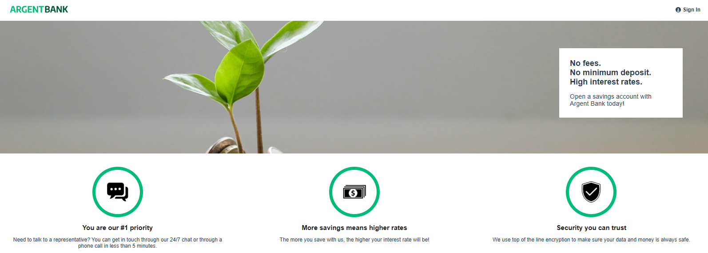

# Argent Bank - Banque en ligne

---

## Description

ArgentBank est une application de banque en ligne permettant aux utilisateurs de visualiser leurs comptes bancaires.

## Fonctionnalités

- Connexion / Déconnexion.
- Visualisation des transactions bancaires.
- Ajout / Modification / Suppression d'une transaction.
- Modification du nom d'utilisateur.

## Prérequis

Les logiciels suivants doivent être installés :

- Node.js
- npm ou yarn pour la gestion des dépendances

## Installation du back-end

- Cloner le dépot Git fourni par OpenClassRooms
- Suivre les instructions du Readme.md

## Installation du front-end

- Cloner ce dépot Git
- Installer les dépendances: `npm install`
- Lancer le front-end: `npm run dev`
- Le front-end sera accessible à l'URL `http://localhost:5173/`

## Dépendances utilisées

- **jsdoc**: ^4.0.4
- **prop-types**: ^15.8.1
- **react**: ^19.0.0
- **react-dom**: ^19.0.0,
- **react-router**: ^7.4.0
- **react-router-dom**: ^7.4.0
- **sass**: ^1.86.0

Projet développé avec **Vite** ^6.2.0
